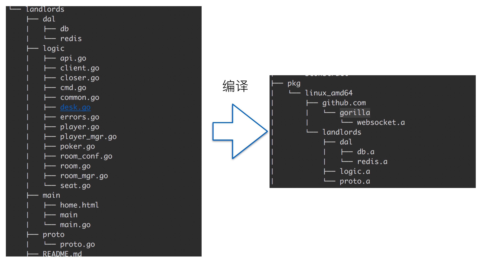
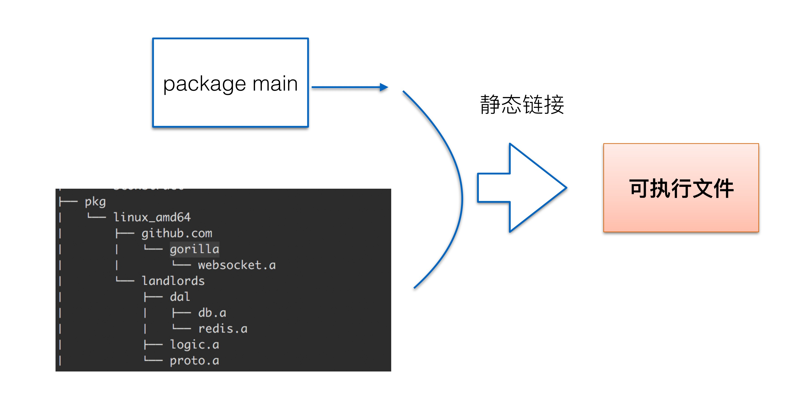
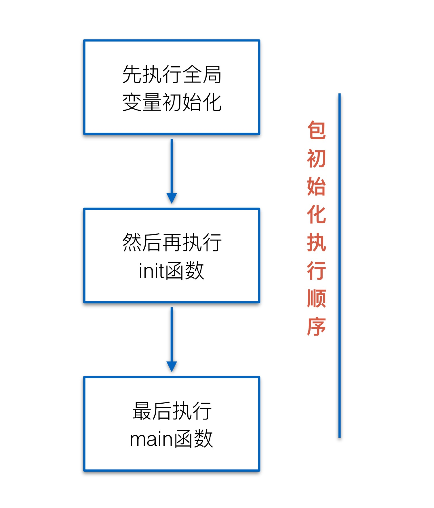
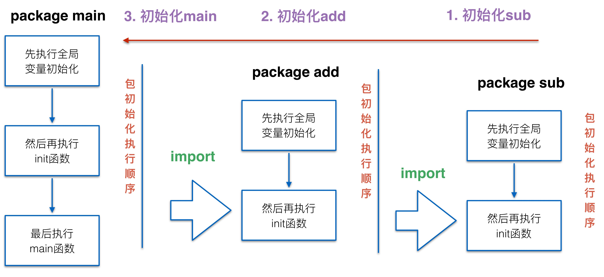

## 目录
1. go源码组织方式
2. main 函数和 main 包
3. 自定义包
4. init 函数以及执行顺序
5. 课后作业

## go 的源码组织方式
1. go 通过 package 的方式来组织源码

2. package 包名
-  注意：任何一个源码都属于一个包
-  作用：代码复用和可读性

## main 函数和 main 包

1. 可执行程序的包名必须为 main，并且包含一个 main 函数

```go
package main

import (
 "fmt"
)

func main() {
    fmt.Println("hello world")
}
```
2. package 组织案例


3. 链接过程


## 自定义包
1. 除了可执行程序之外，用户可以写自定义包，自定义包编译成静态库

```go
package calc

import (
 "fmt"
)

func Add(a,b int) int {
    return a + b
}
```

2. 导出变量或函数。首字母大写表示可导出，小写表示私有。不能被外部的包访问

```go
package calc

import (
 "fmt"
)

func Add(a,b int) int {
    return a + b
}
```

## 编译命令
1. `go run`  运行 go 代码，如果有多个文件，需要把所有文件都写到 `go run` 后面
2. `go bulid` 编译 go 代码，如果是可执行程序， 默认会在当前目录生成可执行程序，可以使用 `-o` 指定可执行程序程序生成的目录。
3. `go install` 编译 go 代码，并且把可执行程序拷贝到  GOPATH 的 `bin` 目录，自定义或者第三方包会拷贝到 GOPATH 的 `pkg`，目录

## init 函数
1. 一个包里可以有 0个或多个 init 函数，在程序启动时会被自动调用

```go
package calc

import (
 "fmt"
)

var a int = 10
func init(){

}

func Add(a,b int) int {
    return a + b
}
```



> 总结：先执行全局变量是初始化 --> 然后再执行 init 函数 --> 最后执行 main 函数

2. 如果一个包 import 另外一个包


## 标示符
`_` 标示符的另外一种用法

```go
package calc 

import (
 "fmt"
 _ "sub"
)

func Add(a,b int) int {
    return a + b
}
```

## 课后练习
1. 你有50枚⾦金金币，需要分配给以下⼏几个⼈人:Matthew, Sarah, Augustus, Heidi, Emilie,
   Peter, Giana, Adriano, Aaron, Elizabeth。分配规则如下所示:
   
- a. 名字中包含’a’或’A’: 1枚⾦金金币 
- b. 名字中包含’e’或’E’: 1枚⾦金金币 
- c. 名字中包含 ‘i’或’I’: 2枚⾦金金币 
- d. 名字中包含’o’或’O’: 3枚⾦金金币 
- e. 名字中包含’u’或’U’: 5枚⾦金金币

写一个程序，计算每个⽤用户分到了了多少⾦金金币，以及最后剩余多少⾦金金币?

```go
package main

import "fmt"

var (
	coins = 100
	users = []string{
		"Matthew", "Sarah", "Augustus", "Heidi", "Emilie",
		"Peter", "Giana", "Adriano", "Aaron", "Elizabeth",
	}
	distribution = make(map[string]int, len(users))
)

func calcCoin(username string) int {
	var sum int = 0
	for _, char := range username {
		switch char {
		case 'a', 'A':
			sum = sum + 1
		case 'e', 'E':
			sum = sum + 1
		case 'i', 'I':
			sum = sum + 2
		case 'o', 'O':
			sum = sum + 3
		case 'u', 'U':
			sum = sum + 5
		}
	}

	return sum
}

func dispatchCoin() int {
	var left int = coins
	for _, username := range users {
		allCoin := calcCoin(username)
		left = left - allCoin
		value, ok := distribution[username]
		if !ok {
			distribution[username] = allCoin
		} else {
			distribution[username] = value + allCoin
		}
	}
	return left
}

func main() {

	left := dispatchCoin()
	for username, coin := range distribution {
		fmt.Printf("user:%s have %d coins\n", username, coin)
	}

	fmt.Printf("left coin:%d\n", left)
}

```