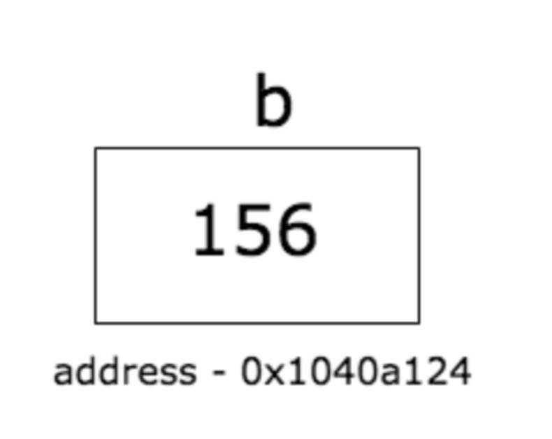
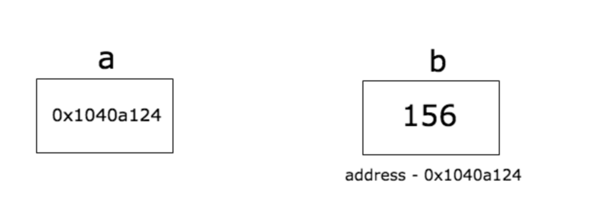
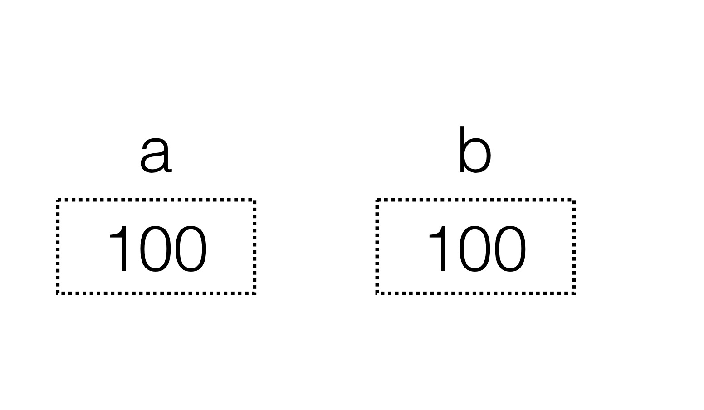
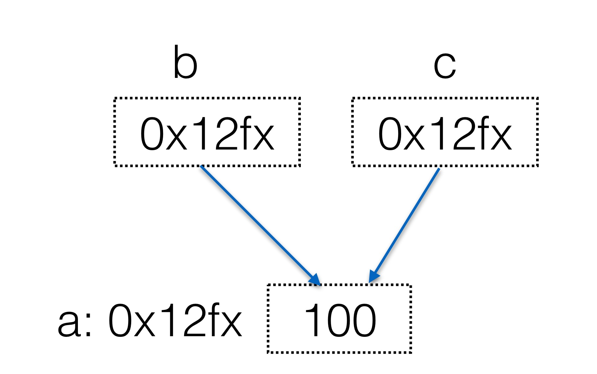

## 目录
1. 变量和内存地址
2. 指针类型
3. 值拷贝和引用拷贝
4. 课后练习

## golang 指针类型
1. 每个变量都有内存地址，可以说通过变量来操作对应大小的内存
```go
var a int32
a = 100
fmt.Printf("%d\n",a)
fmt.Printf("%p\n",&a)
```
注意：通过 `&` 符号可以获取变量的地址

2. 普通的变量存储的是对应类型的值，这些类型就叫 `值类型`
```go
var b int32
b = 156
fmt.Printf(“%d\n”, b) fmt.Printf(“%p\n”, &b)
```


3. 指针类型的变量存储的是一个地址，所以又叫指针类型或者引用类型
```go
 var b int32
 b = 156
 var a *int32
 a = &b
```


4. 指针类型定义，var 变量名 *类型
```go
package main

 import (
   "fmt"
)

 func main() {
 	b := 255
    var a *int = &b
    fmt.Printf("Type of a is %T\n", a)
    fmt.Println("address of b is", a)
}
```

5. 执行类型变量的默认值为 nil, 也就是空地址
```go
package main
import (
  "fmt"
)
func main() {
    a := 25
    var b *int
    if b == nil {
        fmt.Println("b is", b)
        b = &a
        fmt.Println("b after initialization is", b)
    }
}
```

6. 如果操作指针变量地址的地址里面的值呢？
```go
package main
import (
 "fmt"
)
func main()  {
 b := 255
 a := &b
 fmt.Println("address of b is",a)
 fmt.Println("value of b is",*a)
}
```
	*注意：通过 `*` 可以获取指针变量指向的变量`*

7. 通过指针修改变量的值
```go
package main
import (
 "fmt"
)
func main() {
 b :=255
 a := &b
 fmt.Println("address os b is",a)
 fmt.Println("value of b is",*a)
 *a ++
 fmt.Println("new value of b is",b)
}
```

8. 指针变量传参
```go
package main
import (
 "fmt"
)
func change(val *int) {
  *val = 55
}
func main() {
    a := 58
    fmt.Println("value of a before function call is",a)
    b := &a
    change(b)
    fmt.Println("value of a before function call is",a)
}
```

9. 指针变量传参示例2
```go
package main
import (
 "fmt"
)
func modify(arr *[3]int) {
  (*arr)[0] = 90
}
func main() {
    a := [3]int{89,90,91}
    modify(&a)
    fmt.Println(a)
}
```

10. 切片传参
```go
package main
import (
 "fmt"
)
func modify(sls []int) {
    sls[0] = 90
}
func main() {
    a := [3]int{89,90,91}
    modify(a[:])
    fmt.Println(a)
}
```

*注意： 切片是引用类型* 

11. `make` 用来分配引用类型的内存，比如 `map` 、`slice` 以及 `channel`, `new` 用来分配除引用类型的所有其他类型的内存，比如 `int` 数组等

12. 值拷贝和引用拷贝
```go
package main
import (
 "fmt"
)
func main() {
    var a int = 100
    b := a
}
```
	

13. 值拷贝和引用拷贝
```go
package main
func main() {
    var a int = 100
    var b *int = &a
    var c *int = b
    *c = 200
}
```
	


## 课后练习

1. 写一个程序，获取一个变量的地址，并打印到终端。
```go
package main
import (
"fmt"
)
var a int
func main() {
    fmt.Scanln(&a)
    fmt.Printf("address a of:%p\n",&a)
}
```

2. 写一个函数，传入一个 int 类型的指针，并在函数中修改锁指向的值
```go
package main
import (
 "fmt"
)
func modify(a *int){
    *a = 100
}
func main() {
  var a int = 10
    fmt.Printf("before modify: %d addr:%p\n", a, &a)
    modify(&a)
    fmt.Printf("after modify: %d addr:%p\n", a, &a)
}
```

3.  交换两个变量的值
```go
package main
import (
 "fmt"
)
func swap(a *int, b *int)  {
    *a, *b = *b,*a
    fmt.Printf("after a=%d b=%d\n", *a, *b)
}
func main() {
    var a int = 10
    var b int = 20
    swap(&a,&b)
    fmt.Printf("in main a=%d b=%d\n", a, b)
}
```

## code 

```go
package main

import (
	"fmt"
)

func TestPoint1() {
	var a int32
	a = 1000
	fmt.Printf("the addr of a :%p, a:%d\n", &a, a)

	var b *int32
	fmt.Printf("the addr of b: %p, b:%v\n", &b, b)
	if b == nil {
		fmt.Println("b is nil addr")
	}
	//*b = 100
	b = &a
	fmt.Printf("the addr of b: %p, b:%v\n", &b, b)
}

func testPoint2() {
	var a int = 200
	var b *int = &a
	fmt.Printf("b指向的地址存储的值为:%d\n", *b)
	*b = 1000
	fmt.Printf("b指向的地址储存的值为:%d\n", *b)
	fmt.Printf("a = %d\n", a)
}

func modify(a *int) {
	*a = 100
}

func testPoint3() {
	var b int = 10
	p := &b
	modify(p)
	fmt.Printf("b:%d\n", b)
}

func modify_arr(a *[3]int) {
	(*a)[0] = 100
}

func testPoint4() {
	var b [3]int = [3]int{1, 2, 3}
	modify_arr(&b)
	fmt.Printf("b:%v\n", b)
}

func testPoint5() {
	var a *int = new(int)
	*a = 100
	modify(a)
	fmt.Printf("*a=%d\n", *a)

	var b *[]int = new([]int)
	fmt.Printf("*b = %v\n", *b)
	(*b) = make([]int, 5, 100)
	(*b)[0] = 100
	(*b)[1] = 200
	fmt.Printf("*b = %v\n", *b)
}

func modifyInt(a *int) {
	*a = 100
}

func testPoint6() {
	var b = 10
	modifyInt(&b)
	fmt.Printf("b=%d\n", b)
}

func testPoint7() {
	var a int = 10
	var b *int = &a
	var c *int = b
	*c = 200
	fmt.Printf("*c=%d *b=%d a=%d\n", *c, *b, a)
}

func testPoint8() {
	b := 255
	a := &b
	fmt.Println("address of b is", a)
	fmt.Println("value of b is", *a)
}

func testPoint9() {
	b := 255
	a := &b
	fmt.Println("address os b is", a)
	fmt.Println("value of b is", *a)
	*a ++
	fmt.Println("new value of b is", b)
}

func main() {
	TestPoint1()
	testPoint2()
	testPoint3()
	testPoint4()
	testPoint5()
	testPoint6()
	testPoint7()
	testPoint8()
	testPoint9()
}
```

教程对应[github地址](https://github.com/JeffreyBool/go-practice/tree/master/golang%E4%BB%8E%E5%85%A5%E9%97%A8%E5%88%B0%E7%B2%BE%E9%80%9A/listen3)
